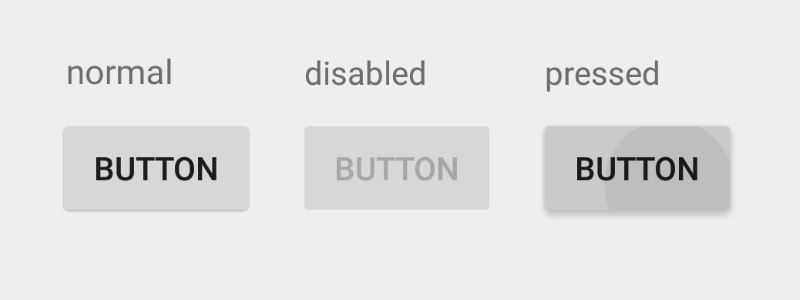
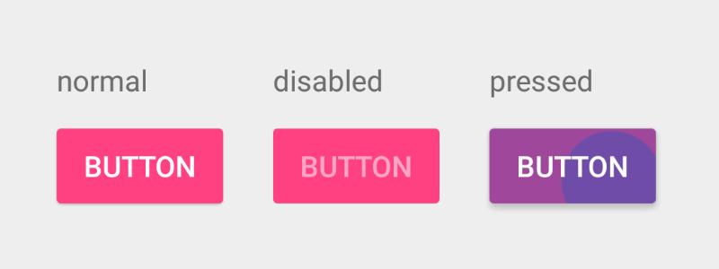
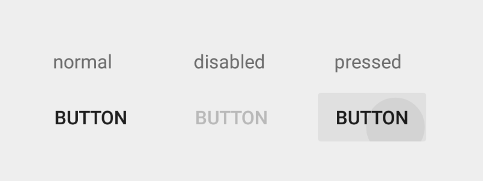
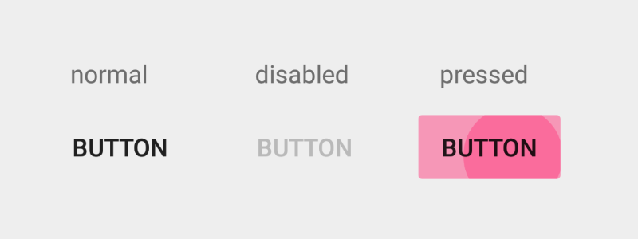

# Buttons

## Raised Button



!!! quote "From google material design [documentation](https://material.io/guidelines/components/buttons.html#buttons-raised-buttons)."
          A typically rectangular material button that lifts and displays ink reactions on press.

### How to add?

I. In your `build.gradle` add latest `appcompat` library.

```
dependencies {
    compile 'com.android.support:appcompat-v7:X.X.X' // where X.X.X version
}
```
II. Make your activity extend `android.support.v7.app.AppCompatActivity`.

```java
public class MainActivity extends AppCompatActivity {
    ...
}
```
III. Declare your `Button` inside any `layout.xml` file

```xml
<Button
    android:layout_width="wrap_content"
    android:layout_height="wrap_content"
    android:text="Button"/>
```

### How to style?



I. Declare custom style in your `styles.xml` file.

```xml
<style name="MyButton" parent="Theme.AppCompat.Light">
    <item name="colorControlHighlight">@color/indigo</item>
    <item name="colorButtonNormal">@color/pink</item>
</style>
```

II. Apply this style to your `Button` via `android:theme` attribute.

```xml
<Button
    android:layout_width="wrap_content"
    android:layout_height="wrap_content"
    android:text="Button"
    android:theme="@style/MyButton"/>
```

### Compatibility issues

!!! note
    To change `Button` color of pressed state you can use `colorControlHighlight` theme attribute, however it will only affect Lollipop version.

!!! note
    Android `elevation` attribute is only available on Lollipop devices therefore you will not see shadow around `Button` on pre Lollipop devices.

## Flat Button



!!! note "From google material design [documentation](https://material.io/guidelines/components/buttons.html#buttons-flat-buttons).
    A button made of ink that displays ink reactions on press but does not lift.

### How to add?

I. In your `build.gradle` add latest `appcompat` library.

```
dependencies {
    compile 'com.android.support:appcompat-v7:X.X.X' // where X.X.X version
}
```
II. Make your activity extend `android.support.v7.app.AppCompatActivity`.

```java
public class MainActivity extends AppCompatActivity {
    ...
}
```
III. Declare your `Button` inside any `layout.xml` file with `Borderless` style.

```xml
<Button
    android:layout_width="wrap_content"
    android:layout_height="wrap_content"
    android:text="Button"
    style="@style/Widget.AppCompat.Button.Borderless"/>
```

### How to style?



I. Declare custom style in your `styles.xml` file.

```xml
<style name="MyButton" parent="Theme.AppCompat.Light">
    <item name="colorControlHighlight">@color/pink</item>
</style>
```

III. Apply this style to your `Button` via `android:theme` attribute.

```xml
<Button
    android:layout_width="wrap_content"
    android:layout_height="wrap_content"
    android:text="Button"
    android:theme="@style/MyButton"
    style="@style/Widget.AppCompat.Button.Borderless"/>
```
