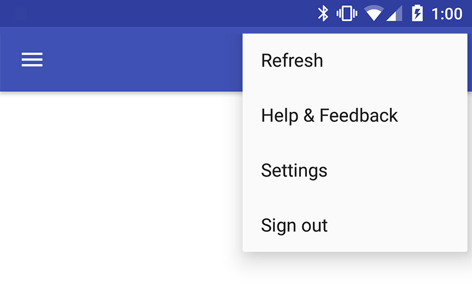
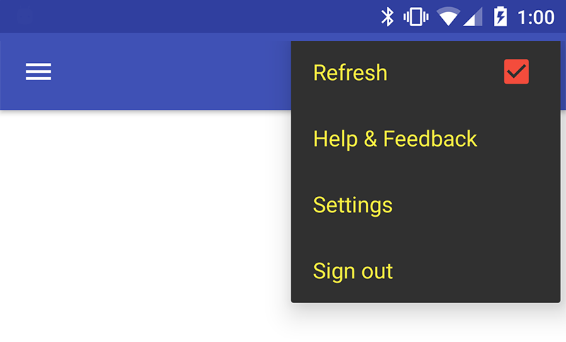

# Menus



!!! note "From the google material design [documentation](https://material.io/guidelines/components/menus.html)"
    Menus allow users to take an action by selecting from a list of choices revealed upon opening a temporary, new sheet of material.

### How to add?

I. In your `build.gradle` add latest `appcompat` library.

```
dependencies {
    compile 'com.android.support:appcompat-v7:X.X.X'
    // where X.X.X version
}
```

II. Make your activity extend `android.support.v7.app.AppCompatActivity`.

```java
public class MyActivity extends AppCompatActivity {
   ...
}
```

III. Create a menu file inside the `res/menu` folder with some items on it.

```xml
<menu xmlns:android="http://schemas.android.com/apk/res/android"
      xmlns:app="http://schemas.android.com/apk/res-auto"
      xmlns:tools="http://schemas.android.com/tools"
      tools:context="com.example.saulmm.myapplication.MainActivity">

    <item
        android:id="@+id/action_refresh"
        android:title="@string/action_refresh"
        app:showAsAction="never"/>

    <item
        android:id="@+id/action_feedback"
        android:title="@string/action_feedback"
        app:showAsAction="never"/>

    <item
        android:id="@+id/action_settings"
        android:title="@string/action_settings"
        app:showAsAction="never"/>

    <item
        android:id="@+id/action_leave"
        android:title="@string/action_leave"
        app:showAsAction="never"/>
</menu>

```

IV. Override activity `onCreateOptionsMenu` method and inflate menu resource.

```java
@Override
public boolean onCreateOptionsMenu(Menu menu) {
    getMenuInflater().inflate(R.menu.menu_main, menu);
    return true;
}
```

### How to style?



I. Declare a custom style extending the `ThemeOverlay.AppCompat.Dark` theme in your `style.xml` file.

```xml
<style name="MyPopupTheme" parent="ThemeOverlay.AppCompat.Dark">
    <item name="android:colorControlActivated">@color/red </item>
    <item name="android:colorControlHighlight">@color/red</item>
    <item name="android:colorControlNormal">@color/yellow</item>
    <item name="android:textColorPrimary">@color/yellow</item>
</style>
```

II. Apply this style to your `Toolbar` via `app:popupTheme`.

```xml
<android.support.v7.widget.Toolbar
    android:id="@+id/toolbar"
    android:layout_width="match_parent"
    android:layout_height="?attr/actionBarSize"
    app:popupTheme="@style/MyPopupTheme" />
```
