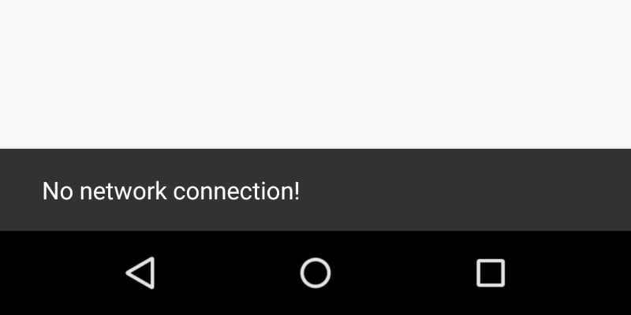
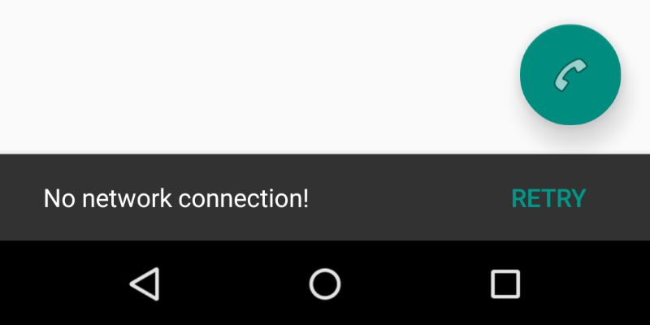
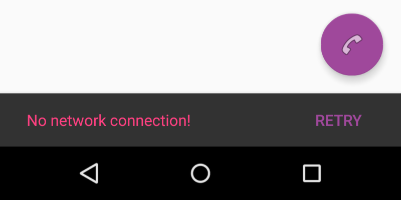
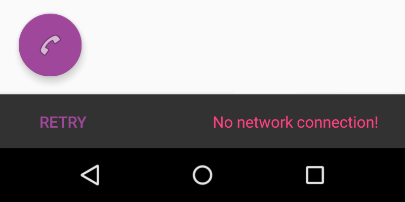
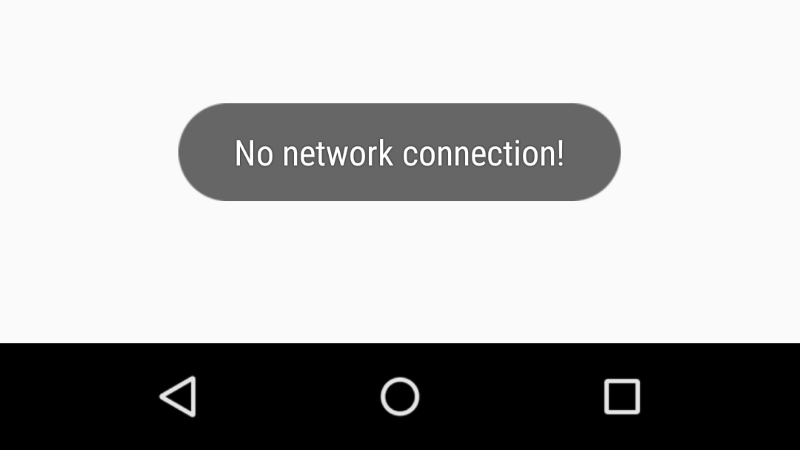
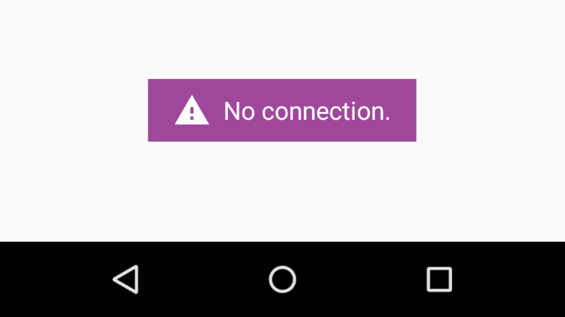

# Snackbars & Toasts

## Snack Bar



!!! quote "From google material design [documentation](https://material.io/guidelines/components/snackbars-toasts.html)."
    Snackbars provide lightweight feedback about an operation by showing a brief message at the bottom of the screen. Snackbars can contain an action.

### How to add?

I. In your `build.gradle` add latest `design` library.

```
dependencies {
    // optionally, Snackbar can be used in pair
    // with CoordinatorLayout
    // compile 'com.android.support:appcompat-v7:X.X.X'

    compile 'com.android.support:design:X.X.X' // where X.X.X version
}
```

II. Create `Snackbar` instance with `make()` method. Then call `show()` method.

```java
Snackbar
    .make(view, "No network connection.",Snackbar.LENGTH_SHORT)
    .show();
```

Parameter `view` is used to find parent. Snackbar will be displayed over it.

!!! note
    Snackbar will try and find a parent `view` to hold Snackbar's view from the value given to view. Snackbar will walk up the view tree trying to find a suitable parent, which is defined as a `CoordinatorLayout` or the window decor's content view, whichever comes first.

#### Duration

To specify how long `Snackbar` will be visible on screen use `setDuration` method.

```java
// pre defined constants
Snackbar.LENGTH_SHORT // 1500 millis
Snackbar.LENGTH_LONG // 2750 millis
Snackbar.LENGTH_INDEFINITE

// you can set custom duration
snackbar.setDuration(TimeUnit.MINUTES.toMillis(1));
```

#### Dismiss

To hide `Snackbar` manually at any time use `dismiss()` method.

```java
Snackbar snackBar = Snackbar.make(view, text, duration);
snackBar.dismiss(); //hide snackbar
```

#### Events

To track whenever `Snackbar` was shown or dismissed use `setCallback` method.

```java
Snackbar
  .make(...)
  .setCallback(new Snackbar.Callback() {
    @Override
    public void onDismissed(Snackbar snackbar, int event) {
      // do some action on dismiss
    }
    @Override
    public void onShown(Snackbar snackbar) {
      // do some action when snackbar is showed
    }
  })
```

Parameter `event` from `onDismissed()` is one of predefined constants in [Snackbar.Callback](https://developer.android.com/reference/android/support/design/widget/Snackbar.Callback.html).

#### Actions



Snackbar can contain an action. To add it call `setAction()` method.

```java
Snackbar  
 .make(...)
 .setAction("Retry", new View.OnClickListener() {
             @Override
             public void onClick(View v) {
               // retry to send email here
             }
           })
```

To enable swipe-to-dismiss and automatically moving of widgets like [FloatingActionButton](https://developer.android.com/reference/android/support/design/widget/FloatingActionButton.html) use [CoordinatorLayout](https://developer.android.com/reference/android/support/design/widget/CoordinatorLayout.html) as your root layout.

```xml
<android.support.design.widget.CoordinatorLayout
        xmlns:android="http://schemas.android.com/apk/res/android"
        xmlns:tools="http://schemas.android.com/tools"
        android:layout_width="match_parent"
        android:layout_height="match_parent">

    <android.support.design.widget.FloatingActionButton
            android:layout_width="wrap_content"
            android:layout_height="wrap_content"
            android:layout_gravity="end|bottom"
            android:src="@android:drawable/ic_menu_call"/>
</android.support.design.widget.CoordinatorLayout>
```

### How to style?



#### With theme

I. Declare custom style in your values/styles.xml file.

```xml
<style name="SnackbarTheme" parent="Theme.AppCompat.Light">
    <item name="colorAccent">@color/indigo</item>
    <item name="android:textColor">@color/pink</item>
</style>
```

II. Apply this style to your `Activity` via `android:theme` attribute in `AndroidManifest.xml` file.

```xml
<activity
    android:name=".SnackbarActivity"
    android:theme="@style/SnackbarTheme">
</activity>
```

!!! note
    Applying theme to `Activity` will apply `colorAccent` and `android:textColor` to all of its views.

#### With code

Get `Snackbar` view using `getView()` method and change it properties.

```java
// create instance
Snackbar snackbar = Snackbar.make(view, text, duration);

// set action button color
snackbar.setActionTextColor(getResources().getColor(R.color.indigo));

// get snackbar view
View snackbarView = snackbar.getView();

// change snackbar text color
int snackbarTextId = android.support.design.R.id.snackbar_text;
TextView textView = (TextView)snackbarView.findViewById(snackbarTextId);
textView.setTextColor(getResources().getColor(R.color.indigo));

// change snackbar background
snackbarView.setBackgroundColor(Color.MAGENTA);
```

#### With custom view



I. Declare custom layout in your values/layout folder.

```xml
<?xml version="1.0" encoding="utf-8"?>
<LinearLayout xmlns:android="http://schemas.android.com/apk/res/android"
              android:orientation="horizontal"
              android:layout_width="match_parent"
              android:layout_height="wrap_content">

    <Button
        android:id="@+id/snackbar_action"
        android:layout_width="wrap_content"
        android:layout_height="wrap_content"
        android:layout_marginLeft="@dimen/design_snackbar_extra_spacing_horizontal"              
        android:layout_marginStart="@dimen/design_snackbar_extra_spacing_horizontal"
        android:layout_gravity="center_vertical|right|end"
        android:paddingTop="@dimen/design_snackbar_padding_vertical"
        android:paddingBottom="@dimen/design_snackbar_padding_vertical"
        android:paddingLeft="@dimen/design_snackbar_padding_horizontal"
        android:paddingRight="@dimen/design_snackbar_padding_horizontal"
        android:visibility="gone"
        android:textColor="?attr/colorAccent"
        style="?attr/borderlessButtonStyle"/>

    <TextView
        android:gravity="center_vertical|right"
        android:id="@+id/snackbar_text"
        android:layout_width="wrap_content"
        android:layout_height="wrap_content"
        android:layout_weight="1"
        android:paddingTop="@dimen/design_snackbar_padding_vertical"
        android:paddingBottom="@dimen/design_snackbar_padding_vertical"
        android:paddingLeft="@dimen/design_snackbar_padding_horizontal"
        android:paddingRight="@dimen/design_snackbar_padding_horizontal"
        android:textAppearance="@style/TextAppearance.Design.Snackbar.Message"
        android:maxLines="@integer/design_snackbar_text_max_lines"
        android:layout_gravity="center_vertical|left|start"
        android:ellipsize="end"/>

</LinearLayout>
```

!!! note
    Use `@dimen/design_snackbar` values to match material design guidelines.

    Use `?attr/colorAccent` to apply your Application Theme changes to `Snackbar`.

II. Extend [BaseTransientBottomBar](https://developer.android.com/reference/android/support/design/widget/BaseTransientBottomBar.html) class.

```java
public class CustomSnackbar extends BaseTransientBottomBar<CustomSnackbar> {

    /**
     * Constructor for the transient bottom bar.
     *
     * @param parent The parent for this transient bottom bar.
     * @param content The content view for this transient bottom bar.
     * @param contentViewCallback The content view callback for this transient bottom bar.
     */
    private CustomSnackbar(ViewGroup parent, View content,    
                ContentViewCallback contentViewCallback) {
        super(parent, content, contentViewCallback);
    }
}
```

III. Add [BaseTransientBottomBar.ContentViewCallback](https://developer.android.com/reference/android/support/design/widget/BaseTransientBottomBar.ContentViewCallback.html)

```java
public class CustomSnackbar ... {

  ...

  private static class ContentViewCallback implements        
                       BaseTransientBottomBar.ContentViewCallback {

      // view inflated from custom layout
      private View content;

      public ContentViewCallback(View content) {
          this.content = content;
      }

      @Override
      public void animateContentIn(int delay, int duration) {
          // add custom *in animations for your views
          // e.g. original snackbar uses alpha animation, from 0 to 1
          ViewCompat.setScaleY(content, 0f);
          ViewCompat.animate(content)
                    .scaleY(1f).setDuration(duration)
                    .setStartDelay(delay);
      }

      @Override
      public void animateContentOut(int delay, int duration) {
          // add custom *out animations for your views
          // e.g. original snackbar uses alpha animation, from 1 to 0
          ViewCompat.setScaleY(content, 1f);
          ViewCompat.animate(content)
                    .scaleY(0f)
                    .setDuration(duration)
                    .setStartDelay(delay);
      }
  }
}
```

IV. Add method to create `Snackbar` with custom layout and methods to fill it.

```java
public class final CustomSnackbar ...{

 ...

public static CustomSnackbar make(ViewGroup parent, @Duration int duration) {
     // inflate custom layout
     LayoutInflater inflater = LayoutInflater.from(parent.getContext());
     View content = inflater.inflate(R.layout.snackbar_view, parent, false);

     // create snackbar with custom view
     ContentViewCallback callback= new ContentViewCallback(content);
     CustomSnackbar customSnackbar = new CustomSnackbar(parent, content, callback);

     // set snackbar duration
     customSnackbar.setDuration(duration);
     return customSnackbar;
 }

 // set text in custom layout
 public CustomSnackbar setText(CharSequence text) {
     TextView textView = (TextView) getView().findViewById(R.id.snackbar_text);
     textView.setText(text);
     return this;
 }

  // set action in custom layout
 public CustomSnackbar setAction(CharSequence text, final OnClickListener listener) {
     Button actionView = (Button) getView().findViewById(R.id.snackbar_action);
     actionView.setText(text);
     actionView.setVisibility(View.VISIBLE);
     actionView.setOnClickListener(new View.OnClickListener() {
         @Override
         public void onClick(View view) {
             listener.onClick(view);
             // Now dismiss the Snackbar
             dismiss();
         }
     });
     return this;
 }
}
```

V. Create instance of `CustomSnackbar` and call `show()` method.

```java
CustomSnackbar customSnackbar = CustomSnackbar.make(rooView, CustomSnackbar.LENGTH_INDEFINITE);
customSnackbar.setText("No network connection!");
customSnackbar.setAction("Retry", new View.OnClickListener() {
    @Override
    public void onClick(View v) {
        // handle click here
    }
});
customSnackbar.show();
```

## Toast



!!! quote "From google material design [documentation](https://material.io/guidelines/components/snackbars-toasts.html)."
    Android also provides a toast, primarily used for system messaging. Toasts are similar to snackbars but do not contain actions and cannot be swiped off screen.

### How to add?

Create `Toast` instance with `make()` method. Then call `show()` method.

```java
Toast.makeText(context, "No network connection.", duration).show();
```

#### Duration

To specify how long `Toast` will be visible on screen use `duration` parameter of `makeText()` method or `setDuration` method.

```java
// you can use only those 2 predefined constants
duration = Toast.LENGTH_SHORT; // 2000 millis
duration = Toast.LENGTH_LONG; // 3500 millis

toast.setDuration(duration);
```

#### Cancel

To hide `Toast` manually at any time use `cancel()` method.

```java
Toast toast= Toast.make(view, text, duration).show();
toast.cancel(); //hide toast
```

!!! note
    Close the view if it's showing, or don't show it if it isn't showing yet. You do not normally have to call this. Normally view will disappear on its own after the appropriate duration.

#### Positioning

To change position of `Toast` use `setGravity()` method.

```java
int gravity = Gravity.CENTER; // the position of toast
int xOffset = 0; // horizontal offset from current gravity
int yOffset = 0; // vertical offset from current gravity

Toast toast= Toast.make(view, text, duration);
toast.setGravity(gravity, xOffset, yOffset);
```

### How to style?



#### With code

```java
// create instance
Toast toast = Toast.makeText(context, text, duration);

// set message color
TextView textView= (TextView) toast.getView().findViewById(android.R.id.message);
textView.setTextColor(Color.YELLOW);

// set background color
toast.getView().setBackgroundColor(getResources().getColor(R.color.indigo));
```

#### With custom view

I. Declare your custom view inside of any `layout.xml` file.

```xml
<?xml version="1.0" encoding="utf-8"?>
<TextView
        xmlns:android="http://schemas.android.com/apk/res/android"
        android:id="@+id/txtMessage"
        android:layout_width="wrap_content"
        android:layout_height="wrap_content"
        android:drawableStart="@drawable/ic_report_problem"
        android:drawablePadding="8dp"
        android:paddingTop="8dp"
        android:paddingBottom="8dp"
        android:paddingLeft="16dp"
        android:paddingRight="16dp"
        android:gravity="center"
        android:textColor="@android:color/white"
        android:textSize="16dp"
        android:text="No connection."
        android:background="@color/indigo"/>
```

II. Set your custom view to `Toast` via `setView()` method.

```java
// create instance
Toast toast = new Toast(getApplicationContext());

// inflate custom view
View view = getLayoutInflater().inflate(R.layout.toast_view, null);

// set custom view
toast.setView(view);

// set duration
toast.setDuration(Toast.LENGTH_LONG);

// set position
int margin = getResources().getDimensionPixelSize(R.dimen.toast_vertical_margin);
toast.setGravity(Gravity.BOTTOM | Gravity.CENTER_VERTICAL, 0, margin);

// show toast
toast.show();
```
