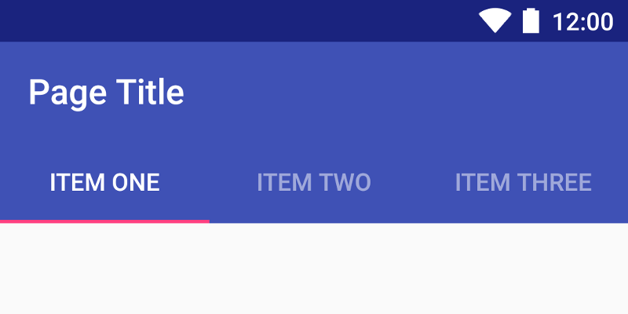
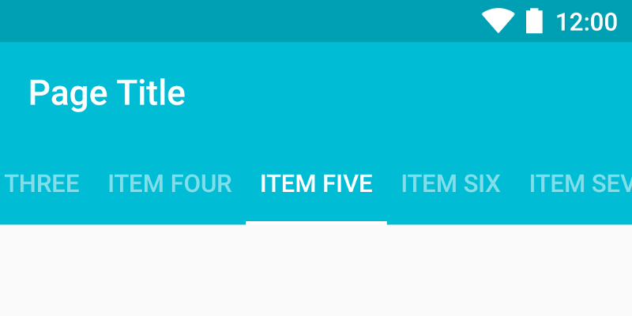

# Tabs


    
!!! note "From google material design [documentation](https://www.google.com/design/spec/components/tabs.html)"
    Tabs make it easy to explore and switch between different views or functional aspects of an app or to browse categorized data sets.


### How to add?

I. In your `build.gradle` add latest `design`  and `appcompat` libraries.

```
dependencies {
    compile 'com.android.support:appcompat-v7:X.X.X'
    compile 'com.android.support:design:X.X.X'
    compile 'com.android.support:support-v13:X.X.X'
    // where X.X.X version

    // if you want to support android sdk < 13
    // you need to add support library v4 instead of v13
}
```

II. Make your activity extend `android.support.v7.app.AppCompatActivity`. 

```java
public class MainActivity extends AppCompatActivity {
 ... 
}
```

III.  Declare `TabLayout` and `ViewPager` in your `layout.xml` file.


```xml

<LinearLayout xmlns:android="http://schemas.android.com/apk/res/android"
    android:layout_width="match_parent"
    android:layout_height="match_parent"
    android:orientation="vertical">

    <android.support.design.widget.TabLayout
        android:id="@+id/tabLayout"
        android:layout_width="match_parent"
        android:layout_height="wrap_content"
        android:background="?attr/colorPrimary"/>

    <android.support.v4.view.ViewPager
        android:id="@+id/viewPager"
        android:layout_width="match_parent"
        android:layout_height="match_parent"/>

</LinearLayout>
```

IV. Setup your `TabLayout` with `ViewPager`.

```java
ViewPager viewPager = (ViewPager) findViewById(R.id.viewPager);

//set adapter to your ViewPager
viewPager.setAdapter(new TabPagerAdapter(getFragmentManager()));

TabLayout tabLayout = (TabLayout) findViewById(R.id.tabLayout);
tabLayout.setupWithViewPager(viewPager);
```

V. Override `getPageTitle` method in your ViewPager's adapter to return tab title.

```java

@Override
public CharSequence getPageTitle(int position) {
     switch (position) {
          case ITEM_ONE:
               return "Item One";
          ...
     }
}
```

### How to style?



I. Declare custom style in your `styles.xml` file.

```xml
<style name="TabLayoutStyle" parent="Widget.Design.TabLayout">
    <item name="tabMaxWidth">@dimen/tab_max_width</item>
    <item name="tabIndicatorColor">@color/pink</item>
    <item name="tabIndicatorHeight">2dp</item>
    <item name="tabPaddingStart">8dp</item>
    <item name="tabPaddingEnd">8dp</item>
    <item name="tabBackground">?attr/selectableItemBackground</item>
    <item name="tabTextAppearance">@style/TabTextAppearance</item>
    <item name="tabSelectedTextColor">@android:color/white</item>
</style>

<style name="TabTextAppearance" parent="TextAppearance.Design.Tab">
    <item name="android:textSize">14sp</item>
    <item name="android:textColor">@color/color_white_semitransparent</item>
    <item name="textAllCaps">true</item>
</style>
```

II. Apply this style to your `TabLayout` via `style` attribute.

```xml
<android.support.design.widget.TabLayout
        style="@style/TabLayoutStyle"
        android:id="@+id/tabLayout"
        android:layout_width="match_parent"
        android:layout_height="wrap_content"/>
```


### Tabs with icons and text


I. Override `getPageTitle` method in your ViewPager's adapter to return tab title.

```java
@Override
public CharSequence getPageTitle(int position) {
     switch (position) {
          case ITEM_ONE:
               return "Item One";
          ...
     }
}
```

II. Create selectors for every tab icon.

```xml
<selector xmlns:android="http://schemas.android.com/apk/res/android">

    <item
        android:state_selected="true"
        android:drawable="@drawable/ic_call_selected" />

    <item
        android:state_selected="false"
        android:drawable="@drawable/ic_call_unselected" />

</selector>
```

III. To change tab icon use `TabLayout.Tab#setIcon` method. You can get `TabLayout.Tab` object via `TabLayout#getTabAt` method, which accept tab index as parameter.

```java
...
//after initialization TabLayout and ViewPager
TabLayout.Tab tabCall = tabLayout.getTabAt(ITEM_CALL);
tabCall.setIcon(R.drawable.selector_call);

//repeat this code for all your tabs
...
```

### Tabs with icons only


I. Create selectors for every tab icon.

```xml
<selector xmlns:android="http://schemas.android.com/apk/res/android">

    <item
        android:state_selected="true"
        android:drawable="@drawable/ic_call_selected" />

    <item
        android:state_selected="false"
        android:drawable="@drawable/ic_call_unselected" />

</selector>
```

II. To change tab icon use `TabLayout.Tab#setIcon` method. You can get `TabLayout.Tab` object via `TabLayout#getTabAt` method, which accept tab index as parameter.

```java
...
//after initialization TabLayout and ViewPager
TabLayout.Tab tabCall = tabLayout.getTabAt(ITEM_CALL);
tabCall.setIcon(R.drawable.selector_call);

//repeat this code for all your tabs
...
```

### Scrollable Tabs



To make your `TabLayout` scrollable add `custom:tabMode` attribute and set it's value to `scrollable`.


```xml

<android.support.design.widget.TabLayout
        xmlns:custom="http://schemas.android.com/apk/res-auto"
        android:id="@+id/tabLayout"
        android:layout_width="match_parent"
        android:layout_height="wrap_content"
        custom:tabMode="scrollable"/>
```
 
### Сentered tabs


To create centered tabs add `custom:tabGravity` attribute and set it's value to `center`.

```xml
<android.support.design.widget.TabLayout
        xmlns:custom="http://schemas.android.com/apk/res-auto"
        android:id="@+id/tabLayout"
        android:layout_width="match_parent"
        android:layout_height="wrap_content"
        custom:tabGravity="center"/>
```
