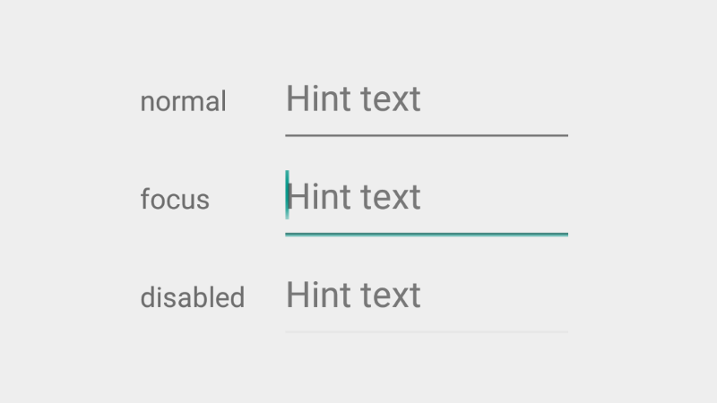
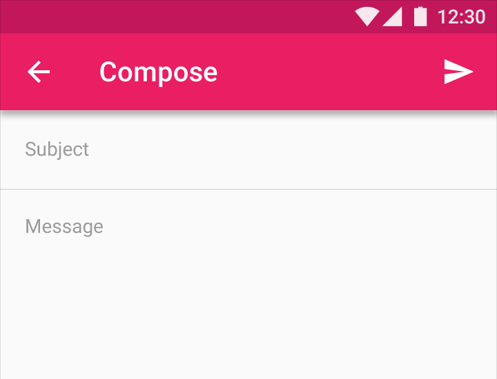
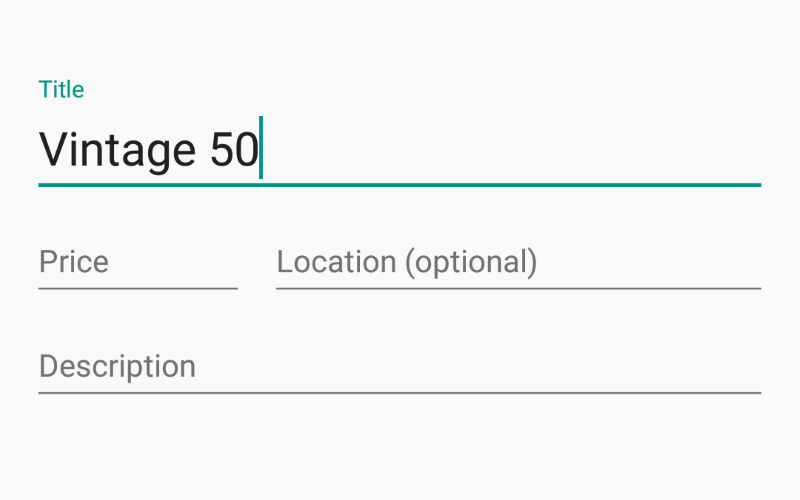
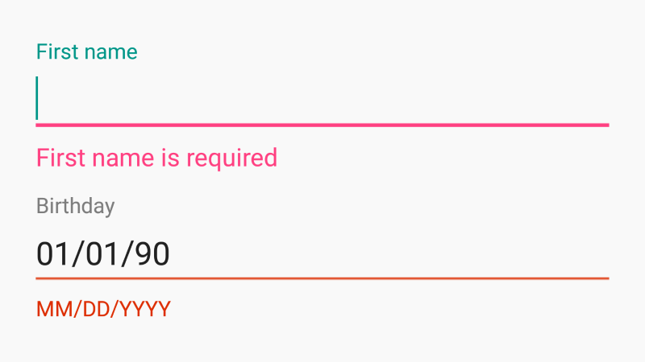
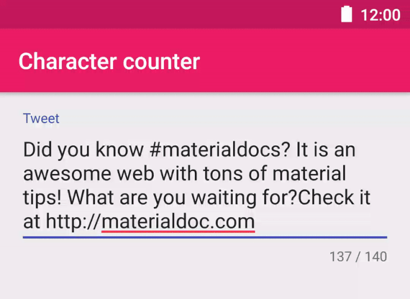
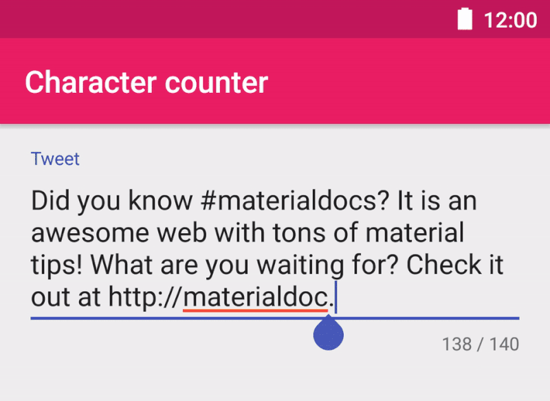

## Text Fields



!!! quote "From google material design [documentation](https://material.io/guidelines/components/text-fields.html)."
    Text fields allow the user to input text, select text (cut, copy, paste), and lookup data via auto-completion.

### How to add?

I. In your `build.gradle` add latest `appcompat` library.

```
dependencies {
    compile 'com.android.support:appcompat-v7:X.X.X' // where X.X.X version
}
```
II. Make your activity extend `android.support.v7.app.AppCompatActivity`.

```java
public class MainActivity extends AppCompatActivity {
    ...
}
```
III. Declare your `EditText` inside any `layout.xml` file.

```xml
<EditText
    android:layout_width="match_parent"
    android:layout_height="wrap_content"
    android:hint="Hint text"/>
```

### How to style?


I. Declare custom style in your `styles.xml` file.

```xml
<style name="MyEditText" parent="Theme.AppCompat.Light">
    <item name="colorControlNormal">@color/indigo</item>
    <item name="colorControlActivated">@color/pink</item>
</style>
```

II. Apply this style to your `EditText` via `android:theme` attribute.

```xml
<EditText
    android:layout_width="match_parent"
    android:layout_height="wrap_content"
    android:hint="Hint text"
    android:theme="@style/MyEditText"/>
```

## Single-line text field

!!! note "From google material design [documentation](https://material.io/guidelines/components/text-fields.html)."
    Single-line fields automatically scroll their content to the left as the text input cursor reaches the right edge of the input field.

To make your `EditText` single line add `android:singleLine` attribute and set it's value to `true`.

```xml
<EditText
    android:layout_width="match_parent"
    android:layout_height="wrap_content"
    android:singleLine="true"
    android:hint="Hint text"/>
```

## Multi-line text field

!!! note "From google material design [documentation](https://material.io/guidelines/components/text-fields.html)."
    Multi-line text fields automatically break to a new line for overflow text and scroll vertically when the cursor reaches the lower edge.

To make your `EditText` multi-line add `android:inputType` attribute and set it's value to `textMultiLine`.

```xml
<EditText
    android:layout_width="match_parent"
    android:layout_height="wrap_content"
    android:inputType="textMultiLine"
    android:hint="Hint text"/>
```

## Full-width text field



!!! note "From google material design [documentation](https://material.io/guidelines/components/text-fields.html)."
    Full-width text fields are useful for more in-depth tasks.

I. Declare custom style in your `styles.xml` file.

```xml
<style name="FullWidthEditText" parent="Widget.AppCompat.EditText">
    <item name="android:padding">20dp</item>
    <item name="android:background">@null</item>
    <item name="android:textSize">@dimen/abc_text_size_subhead_material</item>
</style>
```

II. Apply this style to your `EditText` via `style` attribute.

```xml
<EditText
    style="@style/FullWidthEditText"
    android:layout_width="match_parent"
    android:layout_height="wrap_content"
    android:hint="Subject"/>
```

## Floating labels



!!! note "From google material design [documentation](https://material.io/guidelines/components/text-fields.html)."
    When the user engages with the text input field, the floating inline labels move to float above the field.

### How to add?

I. In your `build.gradle` add latest `appcompat` and `design` libraries.

```
dependencies {
    compile 'com.android.support:appcompat-v7:X.X.X' // where X.X.X version
    compile 'com.android.support:design:X.X.X' // where X.X.X version
}
```
II. Make your activity extend `android.support.v7.app.AppCompatActivity`.

```java
public class MainActivity extends AppCompatActivity {
    ...
}
```
III. Declare your `EditText` inside any `layout.xml` file and wrap it with `TextInputLayout`.

```xml
<android.support.design.widget.TextInputLayout
    android:layout_width="match_parent"
    android:layout_height="wrap_content">

    <EditText
        android:layout_width="match_parent"
        android:layout_height="wrap_content"
        android:hint="@string/Title" />

</android.support.design.widget.TextInputLayout>
```

!!! note
    Both widgets `TextInputLayout` and `EditText` have `android:hint` attribute, you can use any of them.

### How to style?


I. Declare custom styles in your `styles.xml` file.

```xml
<!--Floating label text style-->
<style name="MyHintText" parent="TextAppearance.AppCompat.Small">
    <item name="android:textColor">@color/pink</item>
</style>

<!--Input field style-->
<style name="MyEditText" parent="Theme.AppCompat.Light">
    <item name="colorControlNormal">@color/indigo</item>
    <item name="colorControlActivated">@color/pink</item>
</style>
```

II. Apply this styles to your `TextInputLayout` via `app:hintTextAppearance` attribute and to `EditText` via `android:theme` attribute.

```xml
<android.support.design.widget.TextInputLayout
    android:layout_width="match_parent"
    android:layout_height="wrap_content"
    app:hintTextAppearance="@style/MyHintText">

    <EditText
        android:layout_width="match_parent"
        android:layout_height="wrap_content"
        android:hint="@string/Title"
        android:theme="@style/MyEditText" />

</android.support.design.widget.TextInputLayout>
```

## User input errors


!!! note "From google material design [documentation](https://material.io/guidelines/components/text-fields.html)."
    Help users fix input errors as soon as they are detected. Disable the submission of a form if errors are detected, and if detected only after form submission, clearly explain the error and how to fix it.

### How to add?

I. In your `build.gradle` add latest `appcompat` and `design` libraries.

```
dependencies {
    compile 'com.android.support:appcompat-v7:X.X.X' // where X.X.X version
    compile 'com.android.support:design:X.X.X' // where X.X.X version
}
```
II. Make your activity extend `android.support.v7.app.AppCompatActivity`.

```java
public class MainActivity extends AppCompatActivity {
    ...
}
```
III. Declare your `EditText` inside any `layout.xml` file and wrap it with `TextInputLayout`.

```xml
<android.support.design.widget.TextInputLayout
    android:id="@+id/inputLayout"
    android:layout_width="match_parent"
    android:layout_height="wrap_content"
    app:errorEnabled="true">

    <EditText
        android:layout_width="match_parent"
        android:layout_height="wrap_content"
        android:hint="@string/First_name" />

</android.support.design.widget.TextInputLayout>
```

IV. To show/hide error use `TextInputLayout#setError`.

```java
TextInputLayout inputLayout = (TextInputLayout) findViewById(R.id.inputLayout);
inputLayout.setError("First name is required"); // show error
inputLayout.setError(null); // hide error
```

!!! note
    Declare `app:errorEnabled="true"` attribute inside `TextInputLayout` to reserve space for error label below `EditText`.

### How to style?



I. Declare custom styles in your `styles.xml` file.

```xml
<!--Error label text style-->
<style name="MyErrorText" parent="TextAppearance.AppCompat.Small">
    <item name="android:textColor">@color/pink</item>
</style>

<!--Input field style-->
<style name="MyEditText" parent="Theme.AppCompat.Light">
    <item name="colorControlNormal">@color/indigo</item>
    <item name="colorControlActivated">@color/pink</item>
</style>
```

II. Apply this styles to your `TextInputLayout` via `app:errorTextAppearance` attribute and to `EditText` via `android:theme` attribute.

```xml
<android.support.design.widget.TextInputLayout
    android:layout_width="match_parent"
    android:layout_height="wrap_content"
    app:errorTextAppearance="@style/MyErrorText"
    app:errorEnabled="true">

    <EditText
        android:layout_width="match_parent"
        android:layout_height="wrap_content"
        android:hint="@string/Title"
        android:theme="@style/MyEditText" />

</android.support.design.widget.TextInputLayout>
```

## Character counter



!!! note "From google material design [documentation](https://material.io/guidelines/components/text-fields.html)."
    Use a character counter in fields where a character restriction is in place.

### How to add?
I. Add the last version of the `appcompat` library to your  `build.gradle` file.
```
dependencies {  
    compile 'com.android.support:appcompat-v7:X.X.X'
    // where X.X.X is the last version available
}
```

II. Declare your `EditText` inside any `layout.xml` file and wrap it with `TextInputLayout`. Add `app:counterEnabled` attribute and set it value to `true`. To restrict maximum characters count set some integer value to `app:counterMaxLength` attribute.
```xml
<android.support.design.widget.TextInputLayout
        android:id="@+id/inputLayout"
        android:layout_width="match_parent"
        android:layout_height="wrap_content"
        app:counterEnabled="true"
        app:counterMaxLength="140" >

    <EditText
        android:layout_width="match_parent"
        android:layout_height="wrap_content"
        android:hint="hint text" />

</android.support.design.widget.TextInputLayout>
```

### How to style?


To define a custom style for the overflow.

I. Define the text style.
```xml
<!--Overflow label text style-->
<style name="MyOverflowText" parent="TextAppearance.AppCompat.Small">
    <item name="android:textColor">@color/deep_orange</item>
</style>
```

II. Apply this styles to your `TextInputLayout` via `app:counterOverflowTextAppearance` attribute.
```xml
app:counterOverflowTextAppearance="@style/MyOverflowText"
```
